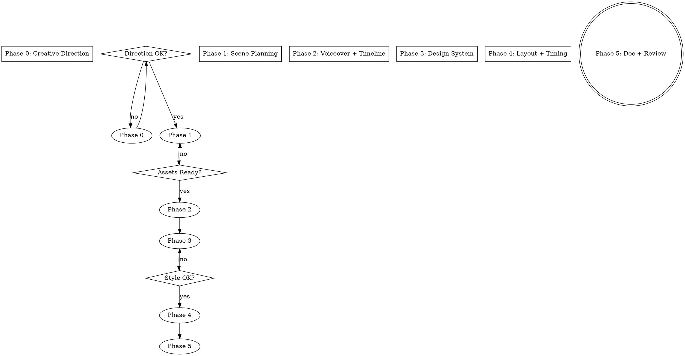

# Remotion Video Design

## Overview

Before writing code, resolve the three biggest sources of rework: **creative direction, assets, and timing**. This skill guides a structured dialogue through 6 phases, each with a gate requiring user confirmation.

**Core principle:** 80% of video rework comes from "unknowns" — direction unknown, assets unknown, layout unknown. Resolve all three before coding.

**File-first workflow:** Save deliverable files as early as possible. Users edit real files faster than they describe changes in conversation. When a phase produces a file, generate the first draft, save it to disk, then tell the user to open and edit it directly.

**Skill Pipeline:** best-practices (reference) → **design (this skill)** → development → review

## When to Use

- Starting a new Remotion video project
- Adding new scenes to an existing video
- Converting a script/text document into a video

**Do NOT use for:**
- Minor tweaks to existing scenes (use remotion-video-review)
- Technical Remotion questions (use remotion-best-practices)
- Screen recording / live demo videos (use OBS + 剪映)
- Real people / camera footage (use 手机 + 剪映)

**Pipeline position:** First step in video creation. Output feeds into remotion-video-development.

## Process Flow



## Phase 0: Creative Direction

**Goal:** Determine "what this video should feel like."

### 0.1 Video Type Assessment

| Video Type | Remotion? | Alternative |
|------------|----------|-------------|
| 概念讲解/技术分享 | YES | - |
| 信息汇总播报 | YES | - |
| 产品吐槽/评论 | YES | - |
| 操作演示教程 | PARTIAL (片头+概念部分) | OBS + 剪映做录屏部分 |
| 日常 Vlog | NO | 手机 + 剪映 |

If Remotion is not suitable, recommend alternatives and stop.

### 0.2 Theme & Mood

Discuss with the user:

```
1. 目标受众？（开发者/产品经理/普通用户）
2. 情绪基调？（严肃专业/轻松幽默/吐槽讽刺/科普教育）
3. 视觉风格？（紧凑高密度/松散留白/现代简约/温暖复古）
4. 配色方向？（冷色科技/暖色亲切/高对比度/低饱和度）
5. 节奏？（快节奏信息轰炸/慢节奏详细讲解）
```

Open `assets/style-gallery.html` in browser — 20 种预设视觉风格，支持标签筛选（暗色/亮色/科技/教育/吐槽/播报等），每种风格附带适合的视频类型说明和 theme.ts 配色常量。让用户从中选择或混搭。

如果预设风格都不合适，再讨论定制方案。

### 0.3 Script Review

Read text.md / voiceover-text.json. Evaluate and suggest:

| Check | What to Look For |
|-------|-----------------|
| 口播自然度 | 句子太长、嵌套太多 → 建议拆短句 |
| 信息密度 | 每场景建议 1-2 个核心观点，≤ 5 个视觉元素 |
| 节奏感 | 是否有高低起伏？全是信息轰炸还是缺少实例？ |
| 场景切分点 | 话题转换、情绪变化、信息块切换处适合切场景 |
| 书面语 vs 口语 | "首先我们需要了解" → "先说说什么是…" |

**Present concrete adjustment suggestions.** User confirms final script.

Save script to `voiceover-text.json` — user can edit this file directly for wording tweaks.

✋ **Gate:** User confirms creative direction and script is finalized.

**Git checkpoint:**
```bash
[ ! -d .git ] && git init  # initialize if needed
git add -A && git commit -m "init: creative direction + script finalized"
```

## Phase 1: Scene Planning

**Goal:** Determine "how many scenes, what each covers, what assets needed."

### 1.1 Scene Structure

Determine scene count (typical: 3-8 for 1-5 min video) and each scene's purpose:

```
| Scene | Duration | Purpose      | Key Visuals         |
|-------|----------|--------------|---------------------|
| 1     | ~10s     | Hook         | Title + tagline     |
| 2     | ~30s     | Context      | 3 info cards        |
| 3     | ~45s     | Detail       | Screenshot + text   |
```

Information density rule: each scene ≤ 5 visual elements. If more, split the scene.

### 1.2 Asset Planning

```
ASSET CHECKLIST:
[ ] voiceover-text.json — finalized script (Phase 0 output)
[ ] Screenshots — which screens, ASCII filenames
[ ] Images/icons — cards, backgrounds, decorations
[ ] Video clips — short embedded clips (if any)
[ ] Data — numbers/data for charts or comparisons
```

User collects assets. Don't proceed until all confirmed available.

### 1.3 Pronunciation Pre-check

Scan voiceover text for TTS-prone words. Check `~/.claude/tts-rules/tts-replacements.json` for existing rules.

| Pattern | Examples | Risk |
|---------|----------|------|
| English brands | Kimi, GLM, DeepSeek | Letter-by-letter reading |
| English + numbers | K2.5, GPT-4 | Number mangled |
| Hyphenated compounds | llm-simple-router | Wrong pauses |
| All-caps abbreviations | API, TTS, LLM | Spelled out |
| Mixed zh/en | "一个月200块" | Number confusion |

Suggest rules for uncovered words. User confirms → add to tts-replacements.json.

✋ **Gate:** User confirms scene plan is reasonable and assets available.

**Git checkpoint:** `git add -A && git commit -m "design: scene plan + asset list confirmed"`

## Phase 2: Voiceover & Timeline

Generate audio and extract timing data.

### 2.1 Generate Voiceover

```bash
python ~/.claude/skills/remotion-tools/generate-voiceover.py
```

Output: `scene{N}_seg{K}.mp3` + `scene{N}_seg{K}_subtitle.json` + `scene{N}_segments.json` per scene.

CLI flags: `--scene scene3`, `--segment 1`, `--force`

### 2.2 Align Timeline

```bash
python ~/.claude/skills/remotion-tools/align-timeline.py
```

Output: `docs/timeline-auto.md` with suggested T constants.

**If Minimax balance is low:**
1. `python ~/.claude/skills/remotion-tools/prepare-minimax-text.py --scene sceneN`
2. User generates at https://www.minimaxi.com/audio/text-to-speech
3. Re-run `generate-voiceover.py` to build `segments.json`

**Git checkpoint:** `git add -A && git commit -m "design: voiceover generated + timeline aligned"`

## Phase 3: Design System

**Goal:** Derive visual constants from Phase 0 creative direction.

Produce `src/styles/theme.ts`:

| Category | Must Define | Source |
|----------|-------------|--------|
| Colors | bg, primary, secondary, text, error, success | Phase 0 mood |
| Font sizes | xs through hero (6 levels) | Phase 0 density |
| Spacing | xs through xl (4 levels) | Phase 0 compact/spacious |
| Scene durations | Per-scene frame counts | segments.json total_frames |
| Image map | ASCII filename constants | Phase 1 asset list |

**One-frame verification:** Render Scene 1 with `npx remotion still`. Show to user.

Generate `theme.ts` from the selected style gallery colors. User can open and edit this file directly to tweak individual colors.

✋ **Gate:** User says "visual feel is right."

**Git checkpoint:** `git add -A && git commit -m "design: theme.ts visual system confirmed"`

## Phase 4: Layout & Timing

**Goal:** Define per-scene layout and animation timing.

### 4.1 Layout Spec

For each scene, produce:

```yaml
sceneN:
  voiceover: "exact text"
  layout:
    type: vertical | horizontal | grid
    regions:
      - name: "title area"
        type: flex-column
        content: [title_text, divider]
      - name: "main area"
        type: horizontal-split
        left: [element_list]
        right: [element_list]
        alignment: flex-start | flex-end | center | stretch
  elements:
    - id: elem1
      type: text | card | image | bar-chart | block | video
      content: "..."
      style: { fontSize, color, fontWeight }
      timing: { enter: frameN, animation: fadeIn | bounce | typewriter }
```

**Layout principles:**
- Flex flow for ordered content, absolute ONLY for overlays
- `alignItems: "flex-end"` for bottom alignment
- `margin: "0 auto"` + fixed width for centering
- `objectFit: "contain"` ALWAYS for screenshots
- macOS title bar for screenshot containers

### 4.2 Scene Final-Frame Mockups

For PPT-like static scenes (info cards, comparisons, title cards), generate HTML mockups showing each scene's **final frame** — what the viewer sees after all animations complete.

**Why:** HTML mockup iterates in seconds (write → browser refresh), vs Remotion code iterates in minutes (code → tsc → render). For layout-heavy scenes, the final frame IS the main visual.

**How:**
1. Create one HTML file per scene: `docs/mockups/scene{N}-final.html`
2. Use the style's color palette (from Phase 0 selection) as inline CSS
3. Include all elements visible at the scene's last frame
4. Use fixed 1920×1080 viewport dimensions
5. User opens files in browser, gives feedback on layout/spacing/sizing

**Scope:** Only for scenes where layout is the primary concern. Skip for pure animation scenes (kinetic text, transitions).

### 4.3 Timeline Mapping

Map subtitle timestamps to animation triggers:

- Animation aligns with segment **start** → use `seg_begin_frame` directly
- Animation **within** a segment → character-ratio:
  ```
  seg_start = subtitle_seg.begin_frame
  seg_duration = subtitle_seg.end_frame - subtitle_seg.begin_frame
  offset_frames = (chars_before / seg_total_chars) * seg_duration
  animation_frame = seg_start + offset_frames
  ```
- Fallback (no subtitle files) → pure character-ratio

### 4.4 Template Reuse Assessment

Mark which components can be reused across videos:
- **Reusable:** title cards, transition animations, info cards, closing screens
- **Video-specific:** unique data visualizations, specific screenshots

Reusable components → extract to shared modules during development.

## Phase 5: Design Doc + Review

Save to `docs/video-design.md`:
- Creative direction summary (mood, tone, style keywords from Phase 0)
- Per-scene layout spec (structured YAML from Phase 4)
- Timeline reference (link to timeline-auto.md)
- Asset list with filenames (from Phase 1)
- Template reuse plan (from Phase 4.3)

### Review

1. **Self-review checklist:**
   - [ ] Every voiceover segment has a corresponding animation
   - [ ] Every image asset is referenced by ASCII filename
   - [ ] Layout uses flex flow (not absolute) for ordered content
   - [ ] No `objectFit: cover` for screenshots
   - [ ] Voiceover text and page text are semantically consistent
   - [ ] Information density per scene ≤ 5 visual elements
   - [ ] TTS pronunciation fixes documented

2. **Independent reviewer** — dispatch subagent using `design-reviewer-prompt.md`

## Transition

After design review passes and user approves:

→ **Invoke remotion-video-development** to implement scenes.

If Remotion handles only partial content (e.g., title cards + data viz, but demo parts need screen recording):

→ Suggest **hybrid workflow**: Remotion renders programmatic parts as MP4 segments, OBS records demo parts, FFmpeg concatenates:
```bash
ffmpeg -f concat -safe 0 -i filelist.txt -c copy output.mp4
```

**Git checkpoint:** `git add -A && git commit -m "design: video-design.md complete"`

## Deliverables

| Phase | Output Files |
|-------|-------------|
| Phase 0 | `voiceover-text.json` (finalized script), selected style from `assets/style-gallery.html` |
| Phase 1 | Assets in `public/images/` |
| Phase 2 | `public/voiceover/scene{N}_seg{K}.mp3`, `*_subtitle.json`, `*_segments.json`, `docs/timeline-auto.md` |
| Phase 3 | `src/styles/theme.ts` |
| Phase 4 | `docs/mockups/scene{N}-final.html` (per-scene final-frame mockups) |
| Phase 4-5 | `docs/video-design.md` |

## Red Flags

- User says "just start coding" → Resist. List what's unknown.
- No voiceover audio yet → Generate first, frame counts depend on duration.
- User describes layout as "move X a bit" → Ask for structured description.
- Images with Chinese filenames → Rename to ASCII.
- Script has 10+ paragraphs for one scene → Split into multiple scenes.
