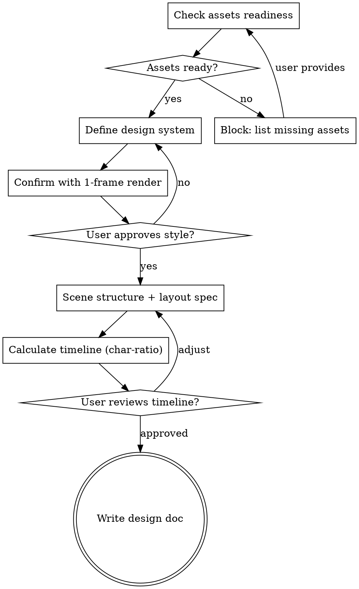

# Remotion Video Design

## Overview

Before writing a single line of Remotion code, lock down the three biggest sources of rework: **assets, layout, and timing**. This skill guides a structured dialogue to produce a complete design spec (design-system + timeline.md + layout spec) that the execution skill can implement in one pass.

**Core principle:** 80% of video project rework comes from three "unknowns" — copy unknown, assets unknown, layout unknown. Resolve all three before coding.

## When to Use

- Starting a new Remotion video project
- Adding new scenes to an existing video
- Receiving a script/text document and asked to "make a video from this"

**Do NOT use for:**
- Minor tweaks to existing scenes (use remotion-video-review instead)
- Technical Remotion questions (use remotion-best-practices instead)

## Process Flow



## Step 1: Assets Readiness Gate

Check all three asset types exist and are production-ready:

```
ASSETS CHECKLIST:
[ ] Final copy/script text (text.md or equivalent)
[ ] Voiceover audio files (public/voiceover/scene{N}.mp3)
    - Use generate-voiceover.py in project root
    - Primary: Minimax TTS API (speech-2.8-hd, Chinese_gravelly_storyteller_vv2)
    - Fallback: edge-tts zh-CN-YunxiNeural rate=+10%
    - Key lookup: env var → .env file → llm-simple-router/minimax-key
    - Voiceover text must match page text (pronunciation fixes allowed)
    - **Pronunciation rules:** Loaded from `~/.claude/voice-replace-text/minimax-tts.json`
      - Rules define text replacements for TTS mispronunciations (e.g., "Kimi" → "key mi")
      - Both `generate-voiceover.py` and `prepare-minimax-text.py` auto-load this file
    - **If Minimax API returns insufficient balance:**
      1. Run `python prepare-minimax-text.py` to get pronunciation-corrected text
      2. Give user the output text for each scene
      3. User goes to https://www.minimaxi.com/audio/text-to-speech
      4. User manually generates audio, downloads MP3 to public/voiceover/scene{N}.mp3
      5. Model: speech-2.8-hd, Voice: Chinese (Mandarin)_Gentleman, Speed: 1
[ ] Screenshot/image assets (public/images/)
    - All filenames MUST be ASCII (staticFile requirement)
    - Each image must have a stated purpose (which scene, which point)
[ ] Font choice confirmed (default: NotoSansSC)
```

**If any asset missing:** List exactly what's needed and STOP. Do not proceed until user provides.

## Step 2: Design System

Produce `src/styles/theme.ts` with:

| Category | Must Define | Default |
|----------|-------------|---------|
| Colors | bg, primary, secondary, text, error, success | Warm cream + deep red-orange |
| Font sizes | xs through hero (6 levels) | 14px-80px |
| Spacing | xs through xl (4 levels) | 6px-36px, compact bias |
| Scene durations | Per-scene frame counts | From voiceover duration |
| Image map | ASCII filename constants | All images used |

**One-frame verification:** Render a single frame of Scene 1 with `npx remotion still`. Show to user. Get "this feels right" before proceeding.

## Step 3: Scene Structure + Layout Spec

For each scene, produce a structured layout description. **Use this format, not natural language:**

```yaml
sceneN:
  voiceover: "exact text from voiceover"
  layout:
    type: vertical | horizontal | grid
    regions:
      - name: "title area"
        type: flex-column
        content: [title_text, divider]
      - name: "main area"
        type: horizontal-split
        left: [element_list]
        right: [element_list]
        alignment: flex-start | flex-end | center | stretch
  elements:
    - id: elem1
      type: text | card | image | bar-chart | block
      content: "..."
      style: { fontSize, color, fontWeight }
      timing: { enter: frameN, animation: fadeIn | bounce | typewriter }
  image_rules:
    - MUST use objectFit: contain (never cover for screenshots)
    - MUST have macOS title bar for screenshot windows
    - MUST have caption below
```

**Layout principles (apply to ALL scenes):**
- Prefer flex flow over absolute positioning for ordered elements
- Use absolute positioning ONLY for overlay elements
- Use `alignItems: "flex-end"` for bottom alignment, not hardcoded heights
- Use `margin: "0 auto"` + fixed width for centered sections
- Content width: 80% or fixed (e.g., 1344px), never percentage for precise layouts

## Step 4: Timeline Calculation (Minimax Subtitle Timestamps)

**Primary method:** Use Minimax TTS `subtitle_enable` feature which returns sentence-level timestamps.

### Workflow

1. **Generate voiceover** with `generate-voiceover.py` — it automatically saves `{sceneN}_subtitle.json`
2. **Run alignment script** to extract precise frame numbers:
   ```bash
   python align-timeline.py
   ```
   This produces `docs/timeline-auto.md` with each subtitle segment's begin/end frame.
3. **Map segments to animations:** For each animation trigger point, find which subtitle segment it belongs to:
   - If animation aligns with a segment **start** → use `seg_begin_frame` directly
   - If animation is **within** a segment → use character-ratio inside that segment only:
     ```
     seg_start = subtitle_seg.begin_frame
     seg_duration = subtitle_seg.end_frame - subtitle_seg.begin_frame
     offset_frames = (chars_before / seg_total_chars) * seg_duration
     animation_frame = seg_start + offset_frames
     ```

### Output format (`docs/timeline.md`)

```markdown
## SceneN (X frames, ~Ys)

### Subtitle segments (from Minimax)
| Seg | Begin Frame | End Frame | Duration | Text |
|-----|-------------|-----------|----------|------|
| 0   | 15          | 443       | 428f     | 昨晚买的... |
| 1   | 448         | 846       | 398f     | 右侧上面... |

### Animation timeline
| Frame | Animation | Matches voiceover | Source |
|-------|-----------|-------------------|--------|
| 15    | Title     | seg0 start        | subtitle |
| 210   | Left img  | "左侧是实际..."   | seg0 char-ratio |
| 448   | Right top | seg1 start        | subtitle |
```

**Key advantage:** Subtitle timestamps provide paragraph-level anchors (±1 frame accuracy). Character-ratio is only used for intra-paragraph positioning, eliminating cumulative error.

**Fallback:** If subtitle files are missing (edge-tts fallback, API error), use pure character-ratio method as documented in remotion-best-practices.

## Step 5: Write Design Doc

Save to `docs/video-design.md`:
- Design system summary (colors, fonts, spacing)
- Per-scene layout spec (structured YAML)
- Timeline reference (link to timeline.md)
- Asset list with filenames

**Self-review checklist:**
- [ ] Every voiceover segment has a corresponding animation
- [ ] Every image asset is referenced by ASCII filename
- [ ] Layout uses flex flow (not absolute) for ordered content
- [ ] No `objectFit: cover` for screenshots
- [ ] Voiceover text and page text are semantically consistent
- [ ] TTS pronunciation fixes noted (e.g., "doubao" → "豆包" in voiceover)

**Transition:** After user approves design doc, invoke remotion-video-development skill.

## Red Flags

- User says "just start coding, we'll figure it out" → Resist. List what's unknown.
- No voiceover audio yet → Generate first, frame counts depend on duration.
- User describes layout as "move X a bit to the left" → Ask for structured description.
- Images have Chinese filenames → Rename to ASCII before proceeding.
