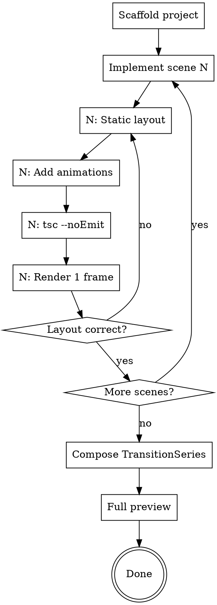

# Remotion Video Development

## Overview

Implement a Remotion video scene-by-scene based on an approved design spec. Each scene follows: static layout → animations → verify. Flex flow by default, absolute positioning only for overlays.

**Core principle:** Code each scene to match the timeline.md exactly. Verify per scene, not at the end.

**Announce at start:** "Using remotion-video-development to implement the video."

**Pipeline position:** Second step. Requires completed design from remotion-video-design. After implementation, transition to remotion-video-review.

## Prerequisites

Before starting, confirm these exist:
- `docs/video-design.md` — approved design spec
- `docs/timeline.md` — animation-voiceover timing
- `src/styles/theme.ts` — design system constants
- `public/voiceover/*_segments.json` — segment metadata (auto-generated by generate-voiceover.py)
- `public/images/` — all image assets with ASCII names

**Missing any?** Stop and resolve before coding.

## Process Flow



## Per-Scene Implementation

### Phase A: Static Layout

Build the scene with all elements visible (no animations, no FadeIn). Verify element sizes, positions, and text content match the layout spec.

**Layout rules:**
```
DEFAULT:  flex flow for ordered content
EXCEPTION: absolute positioning ONLY for overlay elements (floating badges, decorations)
ALIGNMENT: alignItems: "flex-end" for bottom-align, NOT hardcoded heights
CENTERING: margin: "0 auto" + fixed width, NOT percentage
IMAGES:   objectFit: "contain" ALWAYS for screenshots
WINDOWS:  macOS title bar (3 dots) for screenshot containers
```

**Common components to reuse:**
- `FadeIn` — wraps elements with fade animation + optional direction/distance
- `Typewriter` — character-by-character text reveal
- Screenshot window — title bar + Img with contain + caption

### Phase B: Add Animations

Apply the timeline from `docs/timeline.md` (generated by `align-timeline.py` from Minimax subtitle data):

```typescript
// T constants — subtitle timestamps for segment starts,
// character-ratio only for intra-segment offsets
const T = {
  elem1: 15,     // seg0 start (subtitle anchor)
  elem2: 210,    // intra-seg0, char-ratio derived
  elem3: 448,    // seg1 start (subtitle anchor)
} as const;

// Use in FadeIn
<FadeIn delayFrames={T.elem1}>
  <div>...</div>
</FadeIn>

// Use in interpolate for bar animations
const width = interpolate(frame, [T.barStart, T.barEnd], [0, MAX_W], {
  extrapolateLeft: "clamp", extrapolateRight: "clamp",
  easing: Easing.bezier(...EASING.crisp),
});
```

**Timing source priority:**
1. `subtitle_seg.begin_frame` — for animations that align with paragraph starts (most precise)
2. Character-ratio within segment — for animations inside a paragraph
3. Pure character-ratio — fallback when subtitle files unavailable

### Phase C: Verify

After each scene:
1. `npx tsc --noEmit` — must pass, no unused imports
2. `npx remotion still --frame=30` — spot-check mid-scene frame
3. Check: elements appear when voiceover mentions them

## Composition

After all scenes, wire up in `Composition.tsx`:

```typescript
// TransitionSeries with 15-frame fade between scenes
<TransitionSeries>
  <TransitionSeries.Sequence durationInFrames={SCENE1_DURATION}>
    <Scene1 />
  </TransitionSeries.Sequence>
  <TransitionSeries.Transition presentation={fade()} timing={linearDuration(15)} />
  // ... repeat for each scene
</TransitionSeries>
```

`FULL_DURATION = sum of all scene durations - (N-1) * transition_frames`

## Voiceover Integration

Each scene loads `segments.json` and renders multi-segment audio:

```typescript
import segments from "../../public/voiceover/sceneN_segments.json";

{segments.segments.map((seg, i) => (
  <Audio
    key={i}
    src={staticFile(`voiceover/${seg.audio_file}`)}
    volume={0.9}
    from={seg.offset_frames}
    durationInFrames={seg.frames}
  />
))}
```

`<Audio>` 的 `from` 和 `durationInFrames` 原生支持多段音频，不需要 `<Sequence>` 包裹，也不需要 ffmpeg 拼接。

**Prerequisite:** `voiceover-text.json` must exist in project root (created during design phase). `segments.json` is auto-generated by `generate-voiceover.py`.

### theme.ts Duration

Scene duration comes from `segments.json` — read `total_frames` and set as constant:

```typescript
// After generate-voiceover.py, read sceneN_segments.json → total_frames
// Update this value when audio is regenerated:
export const SCENE_N_DURATION = 450; // frames, from segments.json
```

### Pronunciation Pre-check

**Before generating voiceover**, run the pronunciation pre-check (full process in remotion-video-design Step 1b):

1. Read `~/.claude/voice-replace-text/minimax-tts.json` for existing rules
2. Scan `voiceover-text.json` text for TTS-prone words NOT already in rules (English brands, mixed en/numbers, hyphenated compounds, all-caps abbreviations)
3. If new risky words found, present suggestions to user and update JSON before generating

### TTS Generation (Segment-based)

Use `~/.claude/skills/remotion-tools/generate-voiceover.py`:

**Pipeline:** voiceover-text.json → split by sentence → one TTS call per sentence → segments.json

**Output per sentence:**
- `scene{N}_seg{K}.mp3` — audio file
- `scene{N}_seg{K}_subtitle.json` — Minimax timestamps
- `scene{N}_segments.json` — cumulative metadata (frames, offsets, duration)

**CLI flags:**
- `--scene scene3` — only generate a specific scene
- `--segment 1` — only regenerate one sentence (requires --scene)
- `--force` — regenerate even if exists (archives old as _v1, _v2)

**Incremental:** skips existing segments unless `--force`. Old files archived, never deleted.

**If Minimax API returns insufficient balance:**
1. Run `python ~/.claude/skills/remotion-tools/prepare-minimax-text.py` — outputs pronunciation-corrected text per scene
2. User manually generates at https://www.minimaxi.com/audio/text-to-speech
3. Download MP3 to `public/voiceover/scene{N}_seg{K}.mp3`
4. **Note:** Web manual generation does NOT produce subtitle files — use character-ratio for timeline
5. After manual generation, run `generate-voiceover.py` again to build `segments.json` from the files

### Timeline Alignment

After voiceover generation, run `python ~/.claude/skills/remotion-tools/align-timeline.py` to:
1. Read `*_segments.json` to auto-discover scenes
2. Read each segment's subtitle JSON, accumulate frame offsets
3. Output global frame positions for all subtitle parts
4. Generate `docs/timeline-auto.md` with suggested T constants

### Pronunciation Fix Loop

If voiceover is generated but pronunciation is wrong on playback:

1. **Identify the mispronounced word** and which segment it's in (use `npx remotion studio` to find the time)
2. **Add rule** to `~/.claude/voice-replace-text/minimax-tts.json`
3. **Regenerate only the affected segment:**
   ```bash
   python ~/.claude/skills/remotion-tools/generate-voiceover.py --scene scene3 --segment 1 --force
   ```
4. **Re-run timeline alignment:** `python ~/.claude/skills/remotion-tools/align-timeline.py` (timestamps may shift)
5. **Update theme.ts duration** if the scene length changed

**TTS pronunciation fixes:** Voiceover text may differ from display text. Keep display text accurate, fix only pronunciation.

## Error Prevention

| Check | When | Command |
|-------|------|---------|
| TypeScript | After each scene | `npx tsc --noEmit` |
| Unused imports | After layout changes | Check manually or tsc warns |
| Image filenames | Before first render | `ls public/images/` — all ASCII |
| Segments meta | After voiceover gen | `ls public/voiceover/*_segments.json` |
| Timeline match | After animations | `python ~/.claude/skills/remotion-tools/align-timeline.py` then compare |
| Audio sync | Full preview | `npx remotion studio` |

## Common Mistakes

| Mistake | Fix |
|---------|-----|
| `objectFit: cover` on screenshot | Change to `contain` |
| FadeIn wrapping flex container | Move FadeIn INSIDE the container |
| Fixed height on auto-content element | Remove height, let content determine |
| `bottom: N` pushing content off-screen | Use `top: N` or flex flow instead |
| Chinese filename in staticFile() | Rename file to ASCII |

## Completion

After all scenes implemented and verified:
1. Run `npx remotion studio` for full preview
2. Compare each scene against timeline.md
3. **Dispatch implementation reviewer** using `implementation-reviewer-prompt.md` in this skill directory. Checks timeline alignment, layout correctness, composition math, asset references, component consistency. Only flags issues that would produce wrong video output.
4. Fix any issues found by reviewer
5. Commit with descriptive message
6. Transition to remotion-video-review for visual refinement
