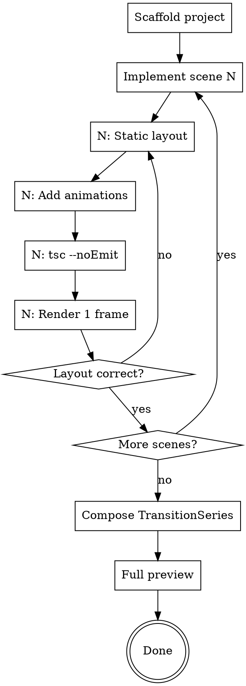

# Remotion Video Development

## Overview

Implement a Remotion video scene-by-scene based on an approved design spec. Each scene follows: static layout → animations → verify. Flex flow by default, absolute positioning only for overlays.

**Core principle:** Code each scene to match the timeline.md exactly. Verify per scene, not at the end.

**Announce at start:** "Using remotion-video-development to implement the video."

## Prerequisites

Before starting, confirm these exist:
- `docs/video-design.md` — approved design spec
- `docs/timeline.md` — animation-voiceover timing
- `src/styles/theme.ts` — design system constants
- `public/voiceover/scene{N}.mp3` — audio files
- `public/images/` — all image assets with ASCII names

**Missing any?** Stop and resolve before coding.

## Process Flow



## Per-Scene Implementation

### Phase A: Static Layout

Build the scene with all elements visible (no animations, no FadeIn). Verify element sizes, positions, and text content match the layout spec.

**Layout rules:**
```
DEFAULT:  flex flow for ordered content
EXCEPTION: absolute positioning ONLY for overlay elements (floating badges, decorations)
ALIGNMENT: alignItems: "flex-end" for bottom-align, NOT hardcoded heights
CENTERING: margin: "0 auto" + fixed width, NOT percentage
IMAGES:   objectFit: "contain" ALWAYS for screenshots
WINDOWS:  macOS title bar (3 dots) for screenshot containers
```

**Common components to reuse:**
- `FadeIn` — wraps elements with fade animation + optional direction/distance
- `Typewriter` — character-by-character text reveal
- Screenshot window — title bar + Img with contain + caption

### Phase B: Add Animations

Apply the timeline from `docs/timeline.md` (generated by `align-timeline.py` from Minimax subtitle data):

```typescript
// T constants — subtitle timestamps for segment starts,
// character-ratio only for intra-segment offsets
const T = {
  elem1: 15,     // seg0 start (subtitle anchor)
  elem2: 210,    // intra-seg0, char-ratio derived
  elem3: 448,    // seg1 start (subtitle anchor)
} as const;

// Use in FadeIn
<FadeIn delayFrames={T.elem1}>
  <div>...</div>
</FadeIn>

// Use in interpolate for bar animations
const width = interpolate(frame, [T.barStart, T.barEnd], [0, MAX_W], {
  extrapolateLeft: "clamp", extrapolateRight: "clamp",
  easing: Easing.bezier(...EASING.crisp),
});
```

**Timing source priority:**
1. `subtitle_seg.begin_frame` — for animations that align with paragraph starts (most precise)
2. Character-ratio within segment — for animations inside a paragraph
3. Pure character-ratio — fallback when subtitle files unavailable

### Phase C: Verify

After each scene:
1. `npx tsc --noEmit` — must pass, no unused imports
2. `npx remotion still --frame=30` — spot-check mid-scene frame
3. Check: elements appear when voiceover mentions them

## Composition

After all scenes, wire up in `Composition.tsx`:

```typescript
// TransitionSeries with 15-frame fade between scenes
<TransitionSeries>
  <TransitionSeries.Sequence durationInFrames={SCENE1_DURATION}>
    <Scene1 />
  </TransitionSeries.Sequence>
  <TransitionSeries.Transition presentation={fade()} timing={linearDuration(15)} />
  // ... repeat for each scene
</TransitionSeries>
```

`FULL_DURATION = sum of all scene durations - (N-1) * transition_frames`

## Voiceover Integration

Each scene includes:
```typescript
<Audio src={staticFile("voiceover/sceneN.mp3")} volume={0.9} />
```

**TTS generation:** Use `generate-voiceover.py` in project root:
- Primary: Minimax TTS API (speech-2.8-hd, Chinese_gravelly_storyteller_vv2 voice)
- Fallback: edge-tts zh-CN-YunxiNeural rate=+10%
- Key lookup: env var MINIMAX_API_KEY → .env file → llm-simple-router/minimax-key
- Script outputs audio duration and frame count for theme.ts
- **Subtitle timestamps:** Minimax returns `subtitle_file` URL — script auto-saves `{sceneN}_subtitle.json`
- **Pronunciation rules:** Auto-loaded from `~/.claude/voice-replace-text/minimax-tts.json`

**If Minimax API returns insufficient balance:**
1. Run `python prepare-minimax-text.py` — outputs pronunciation-corrected text per scene
2. Give user the processed text for each scene
3. User goes to https://www.minimaxi.com/audio/text-to-speech
4. Paste text, settings: model=speech-2.8-hd, voice=Chinese (Mandarin)_Gentleman, speed=1
5. Download MP3 to `public/voiceover/scene{N}.mp3`
6. **Note:** Web manual generation does NOT produce subtitle files — use character-ratio for timeline

**Timeline alignment:** After voiceover generation, run `python align-timeline.py` to:
1. Read `{sceneN}_subtitle.json` (sentence-level timestamps from Minimax)
2. Output paragraph anchor frames (±1 frame accuracy)
3. Generate `docs/timeline-auto.md` with suggested T constants

**TTS pronunciation fixes:** Voiceover text may differ from display text. Document in timeline.md:
- Display: "doubao" → Voiceover: "豆包"
- Keep display text accurate, fix only pronunciation

## Error Prevention

| Check | When | Command |
|-------|------|---------|
| TypeScript | After each scene | `npx tsc --noEmit` |
| Unused imports | After layout changes | Check manually or tsc warns |
| Image filenames | Before first render | `ls public/images/` — all ASCII |
| Subtitle files | After voiceover gen | `ls public/voiceover/*_subtitle.json` |
| Timeline match | After animations | `python align-timeline.py` then compare |
| Audio sync | Full preview | `npx remotion studio` |

## Common Mistakes

| Mistake | Fix |
|---------|-----|
| `objectFit: cover` on screenshot | Change to `contain` |
| FadeIn wrapping flex container | Move FadeIn INSIDE the container |
| Fixed height on auto-content element | Remove height, let content determine |
| `bottom: N` pushing content off-screen | Use `top: N` or flex flow instead |
| Chinese filename in staticFile() | Rename file to ASCII |

## Completion

After all scenes implemented and verified:
1. Run `npx remotion studio` for full preview
2. Compare each scene against timeline.md
3. Commit with descriptive message
4. Transition to remotion-video-review for visual refinement
