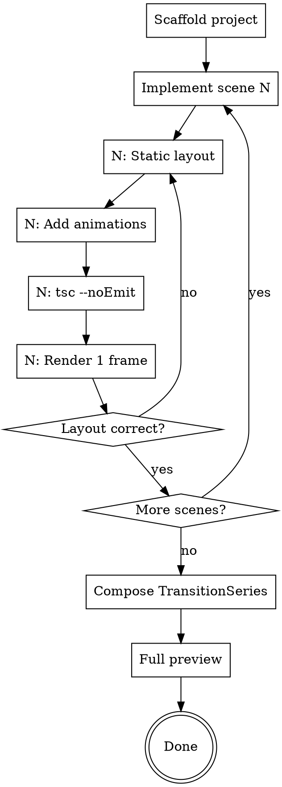

# Remotion Video Development

## Overview

Implement a Remotion video scene-by-scene based on an approved design spec. Each scene follows: static layout → animations → verify. Flex flow by default, absolute positioning only for overlays.

**Core principle:** Code each scene to match the timeline.md exactly. Verify per scene, not at the end.

**File-first workflow:** After implementing each scene, the file is on disk. For quick tweaks (timing constants, colors, spacing), tell the user which file and which constants to edit — faster than another conversation round.

**Announce at start:** "Using remotion-video-development to implement the video."

**CWD discipline:** All shell commands MUST use absolute paths or be prefixed with `cd` to the project root. The Remotion CLI outputs paths relative to CWD, and `npx remotion render --scale=2` will place output in `$CWD/output/` — not necessarily the project's `output/` directory.

```bash
# ALWAYS start every Bash call with:
cd /path/to/project-root && <actual command>

# Or use absolute paths everywhere:
npx remotion render CompositionID /absolute/path/to/output.mp4
```

**4K rendering:** Use `--scale=2` flag — keeps internal 1920x1080 resolution, outputs 3840x2160. No code changes needed.

**Pipeline position:** Second step. Requires completed design from remotion-video-design. After implementation, transition to remotion-video-review.

**CWD discipline — ALL Bash commands in this skill MUST:**
- Use absolute paths for all file operations (output paths, file lists)
- Start with `cd /absolute/path/to/project-root &&` when the context might have drifted
- Never rely on relative CWD for `npx remotion render` output paths — CWD can change between commands

**Rendering resolution:**`--scale=2` to the `npx remotion render` command to produce 4K output 
- No changes needed to WIDTH/HEIGHT, font sizes, or layout — Remotion handles scaling internally

## Prerequisites

Before starting, confirm these exist:
- `docs/video-design.md` — approved design spec
- `docs/timeline.md` — animation-voiceover timing
- `src/styles/theme.ts` — design system constants
- `public/voiceover/*_segments.json` — segment metadata (auto-generated by generate-voiceover.py)
- `public/images/` — all image assets with ASCII names

**Missing any?** Stop and resolve before coding.

## Process Flow



## Per-Scene Implementation

### Phase A-0: Layout Pre-Confirmation

**Before writing ANY code**, present a text-based layout diagram to the user. This prevents the most common cause of rework: the user's mental picture not matching the implementation.

**Steps:**
1. Read the scene's design spec and voiceover text
2. Identify all visual elements and their spatial relationships
3. Create an ASCII layout diagram showing:
   - Container boundaries (CONTAINER_W × CONTAINER_H)
   - Relative positioning (title at top, left/right split, etc.)
   - How elements connect (arrows, lines, direction indicators)
   - Approximate proportions (60/40, centered column, etc.)
4. **Present diagram to user and confirm** before proceeding
5. Do NOT write code until layout is confirmed

**Example format:**
```
┌──────────────────────────────────────────────┐
│                  标题                         │
├─────────────────────┬────────────────────────┤
│    Element A         │   Element B            │
│    (60%)             │   (40%)                │
│                      │   - sub-element        │
│                      │   - sub-element        │
└─────────────────────┴────────────────────────┘
```

**If the scene involves multiple cards/panels with connecting arrows**, the diagram MUST show which card connects to which and in what direction (→, ↓, ↑, etc.).

### Phase A: Static Layout

Build the scene with all elements visible (no animations, no FadeIn). Verify element sizes, positions, and text content match the CONFIRMED layout diagram.

**Layout rules:**
```
DEFAULT:  flex flow for ordered content
EXCEPTION: absolute positioning ONLY for overlay elements (floating badges, decorations)
ALIGNMENT: alignItems: "flex-end" for bottom-align, NOT hardcoded heights
CENTERING: margin: "0 auto" + fixed width, NOT percentage
IMAGES:   objectFit: "contain" ALWAYS for screenshots
WINDOWS:  macOS title bar (3 dots) for screenshot containers
```

**Common components to reuse:**
- `FadeIn` — wraps elements with fade animation + optional direction/distance
- `Typewriter` — character-by-character text reveal
- Screenshot window — title bar + Img with contain + caption

### Phase B: Add Animations

Apply the timeline from `docs/timeline.md` (generated by `align-timeline.py` from Minimax subtitle data):

```typescript
// T constants — subtitle timestamps for segment starts,
// character-ratio only for intra-segment offsets
const T = {
  elem1: 15,     // seg0 start (subtitle anchor)
  elem2: 210,    // intra-seg0, char-ratio derived
  elem3: 448,    // seg1 start (subtitle anchor)
} as const;

// Use in FadeIn
<FadeIn delayFrames={T.elem1}>
  <div>...</div>
</FadeIn>

// Use in interpolate for bar animations
const width = interpolate(frame, [T.barStart, T.barEnd], [0, MAX_W], {
  extrapolateLeft: "clamp", extrapolateRight: "clamp",
  easing: Easing.bezier(...EASING.crisp),
});
```

**Timing source priority:**
1. `subtitle_seg.begin_frame` — for animations that align with paragraph starts (most precise)
2. Character-ratio within segment — for animations inside a paragraph
3. Pure character-ratio — fallback when subtitle files unavailable

### Phase C: Verify

After each scene:
1. `npx tsc --noEmit` — must pass, no unused imports
2. `npx remotion still --frame=30` — spot-check mid-scene frame
3. Check: elements appear when voiceover mentions them
4. `git add -A && git commit -m "feat: scene N implemented"`

## Composition

After all scenes, wire up in `Composition.tsx`:

```typescript
// TransitionSeries with 15-frame fade between scenes
<TransitionSeries>
  <TransitionSeries.Sequence durationInFrames={SCENE1_DURATION}>
    <Scene1 />
  </TransitionSeries.Sequence>
  <TransitionSeries.Transition presentation={fade()} timing={linearDuration(15)} />
  // ... repeat for each scene
</TransitionSeries>
```

`FULL_DURATION = sum of all scene durations - (N-1) * transition_frames`

## Voiceover Integration

Each scene loads `segments.json` and renders multi-segment audio:

```typescript
import segments from "../../public/voiceover/sceneN_segments.json";

{segments.segments.map((seg, i) => (
  <Audio
    key={i}
    src={staticFile(`voiceover/${seg.audio_file}`)}
    volume={0.9}
    from={seg.offset_frames}
    durationInFrames={seg.frames}
  />
))}
```

`<Audio>` 的 `from` 和 `durationInFrames` 原生支持多段音频，不需要 `<Sequence>` 包裹，也不需要 ffmpeg 拼接。

**Prerequisite:** `voiceover-text.json` must exist in project root (created during design phase). `segments.json` is auto-generated by `generate-voiceover.py`.

### theme.ts Duration

Scene duration comes from `segments.json` — read `total_frames` and set as constant:

```typescript
// After generate-voiceover.py, read sceneN_segments.json → total_frames
// Update this value when audio is regenerated:
export const SCENE_N_DURATION = 450; // frames, from segments.json
```

### Pronunciation Pre-check

**Before generating voiceover**, run the pronunciation pre-check (full process in remotion-video-design Step 1b):

1. Read `~/.claude/tts-rules/tts-replacements.json` for existing rules
2. Scan `voiceover-text.json` text for TTS-prone words NOT already in rules (English brands, mixed en/numbers, hyphenated compounds, all-caps abbreviations)
3. If new risky words found, present suggestions to user and update JSON before generating

### TTS Generation (Segment-based)

Use `~/.claude/skills/remotion-tools/generate-voiceover.py`:

**Pipeline:** voiceover-text.json → split by sentence → one TTS call per sentence → segments.json

**Output per sentence:**
- `scene{N}_seg{K}.mp3` — audio file
- `scene{N}_seg{K}_subtitle.json` — Minimax timestamps
- `scene{N}_segments.json` — cumulative metadata (frames, offsets, duration)

**CLI flags:**
- `--scene scene3` — only generate a specific scene
- `--segment 1` — only regenerate one sentence (requires --scene)
- `--force` — regenerate even if exists (archives old as _v1, _v2)

**Incremental:** skips existing segments unless `--force`. Old files archived, never deleted.

**If Minimax API returns insufficient balance:**
1. Run `python ~/.claude/skills/remotion-tools/prepare-minimax-text.py` — outputs pronunciation-corrected text per scene
2. User manually generates at https://www.minimaxi.com/audio/text-to-speech
3. Download MP3 to `public/voiceover/scene{N}_seg{K}.mp3`
4. **Note:** Web manual generation does NOT produce subtitle files — use character-ratio for timeline
5. After manual generation, run `generate-voiceover.py` again to build `segments.json` from the files

### Timeline Alignment

After voiceover generation, run `python ~/.claude/skills/remotion-tools/align-timeline.py` to:
1. Read `*_segments.json` to auto-discover scenes
2. Read each segment's subtitle JSON, accumulate frame offsets
3. Output global frame positions for all subtitle parts
4. Generate `docs/timeline-auto.md` with suggested T constants

### Pronunciation Fix Loop

If voiceover is generated but pronunciation is wrong on playback:

1. **Identify the mispronounced word** and which scene it's in
2. **Add rule** to `~/.claude/tts-rules/tts-replacements.json`
   - Rules sorted by key length (longest first), so compound rules like `"Kimi K2.6"` take priority over individual `"Kimi"` and `"K2.6"`
   - Use enumeration comma `，` to create a short TTS pause between connected words (e.g., `"个子代理" → "个、子代理"`)
3. **Regenerate the scene:**
   ```bash
   python ~/.claude/skills/remotion-tools/generate-voiceover.py --scene sceneN --force
   ```
   Note: `--scene` accepts only ONE scene at a time. For multiple scenes, run separately.

**CRITICAL — After regeneration, complete this atomic sequence:**

4. **Verify generation succeeded:**
   ```bash
   ls public/voiceover/sceneN_seg*.mp3 | grep -v _v
   ```
   If any segment is missing (API rate limit, etc.), restore from archived backup:
   ```bash
   cd public/voiceover
   # Restore failed segments from latest archive (_v1, _v2, etc.)
   for f in sceneN_seg*_v*.mp3; do
     base=$(echo "$f" | sed 's/_v[0-9]*\.mp3$/.mp3/')
     [ ! -f "$base" ] && mv "$f" "$base"
   done
   ```

5. **Duration auto-updated:** `generate-voiceover.py` automatically updates `theme.ts` SCENE_DURATIONS.
6. **Verify audio files exist:**
   ```bash
   ls public/voiceover/sceneN_seg*.mp3 | grep -v _v | wc -l
   ```
   Segment count must match `segments.json`. No ffmpeg merge needed — use multi-segment `<Audio>` in scene code (see Voiceover Integration section).

**Failure recovery:** If `--force` archives original files to `_v1`/`_v2` and API fails, the original files are preserved in the archive. Always check segment count matches expected before proceeding.

**API sample_rate:** The Minimax API rejects `sample_rate: 48000`. Valid values: `32000`, `44100`. The `generate-voiceover.py` script has this configured — update if API changes.

**TTS pronunciation fixes:** Voiceover text may differ from display text. Keep display text accurate, fix only pronunciation.

**Multiple scenes:** If regenerating multiple scenes, process one at a time to reduce blast radius from API failures. Verify each scene before moving to the next.

### Post-Render Audio Verification

After `npx remotion render`, run this check to catch silent/missing audio:

```bash
VO="public/voiceover"
for s in scene1 scene2 scene3 scene4 scene5 scene6 scene7 scene8 scene9 scene10 scene11 scene12; do
  dur=$(ffprobe -v quiet -show_entries format=duration -of csv=p=0 "$VO/${s}.mp3" 2>/dev/null)
  if [ -z "$dur" ] || [ "$(echo "$dur < 1" | bc 2>/dev/null)" = "1" ]; then
    echo "❌ $s: MISSING or <1s"
  else
    echo "✅ $s: ${dur}s"
  fi
done
```

All 12 scenes must return `✅` with duration > 1s before considering the render complete.

## Deliverables

| Output | Files |
|--------|-------|
| Scenes | `src/scenes/Scene{N}.tsx` |
| Shared components | `src/components/{Name}.tsx` |
| Shared animation utils | `src/utils/animation.ts` (ease, fadeIn) |
| Composition | `src/Composition.tsx` (or `Root.tsx`) |
| Updated theme | `src/styles/theme.ts` (if durations changed) |

## Error Prevention

| Check | When | Command |
|-------|------|---------|
| TypeScript | After each scene | `npx tsc --noEmit` |
| Unused imports | After layout changes | Check manually or tsc warns |
| Image filenames | Before first render | `ls public/images/` — all ASCII |
| Segments meta | After voiceover gen | `ls public/voiceover/*_segments.json` |
| Timeline match | After animations | `python ~/.claude/skills/remotion-tools/align-timeline.py` then compare |
| Audio sync | Full preview | `npx remotion studio` |

## Common Mistakes

| Mistake | Fix |
|---------|-----|
| `objectFit: cover` on screenshot | Change to `contain` |
| FadeIn wrapping flex container | Move FadeIn INSIDE the container |
| Fixed height on auto-content element | Remove height, let content determine |
| `bottom: N` pushing content off-screen | Use `top: N` or flex flow instead |
| Chinese filename in staticFile() | Rename file to ASCII |
| **Audio overlap between scenes** | See "Audio Overlap Prevention" below |

### Audio Overlap Prevention

`<Sequence premountFor={N}>` 会让 Audio 组件在场景可见之前 N 帧就开始播放。当 TransitionSeries 的过渡时长叠加时，相邻场景的音频会重叠。

**根本原因：**
- `premountFor={30}` → 音频提前 30 帧（1s @ 30fps）播放
- `TransitionSeries.Transition` fade 过渡占用 15 帧
- 两者叠加 = 相邻场景音频重叠 1.5s

**修复步骤：**

1. **移除所有场景的 `premountFor`**
   ```typescript
   // 删除
   <Sequence premountFor={30}>
     <Audio ... />
   </Sequence>

   // 改为
   <Audio ... />
   ```

2. **在 theme.ts 中为每个场景添加 45f 缓冲**
   ```typescript
   // 场景时长 = 实际音频时长 + 45f 静音缓冲
   // 45f 缓冲确保：音频结束后 30f 静音 + 15f 过渡 = 场景间至少 1s 无音频重叠
   export const SCENE_DURATIONS = {
     scene1: 212,  // 167 + 45
     // ...
   } as const;
   ```

3. **验证**：在 `npx remotion studio` 中播放，确认场景切换时没有两段音频同时播放。

## Template & Reuse

During implementation, identify components marked as "reusable" in the design doc:

- Extract shared components to `src/components/` (e.g., `InfoCard.tsx`, `TitleCard.tsx`, `MacWindow.tsx`)
- Use props for data-driven content (title, subtitle, color, timing)
- Keep animation logic inside the component, controlled by `delayFrames` prop

## Batch Rendering

For template-based videos (same layout, different data), use parameterized rendering:

```typescript
// Composition with props
<Composition
  id="MyVideo"
  component={MyVideo}
  durationInFrames={300}
  fps={30}
  width={1920}
  height={1080}
  defaultProps={{ title: "Default" }}
/>
```

```bash
# Batch render from dataset
npx remotion render MyVideo --props='{"title":"Variant A"}' out/a.mp4
```

See `remotion-best-practices` rules/compositions.md for dataset rendering patterns.

## Hybrid Workflow

If Remotion handles only part of the video (e.g., title cards + data viz, but demo parts use screen recording):

1. Render each Remotion segment as separate MP4
2. Record demo parts with OBS
3. Concatenate with FFmpeg:
   ```bash
   # filelist.txt: file 'remotion_intro.mp4'\nfile 'obs_demo.mp4'\nfile 'remotion_outro.mp4'
   ffmpeg -f concat -safe 0 -i filelist.txt -c copy output.mp4
   ```

## Completion

After all scenes implemented and verified:
1. Run `npx remotion studio` for full preview
2. Compare each scene against timeline.md
3. **Dispatch implementation reviewer** using `implementation-reviewer-prompt.md` in this skill directory. Checks timeline alignment, layout correctness, composition math, asset references, component consistency. Only flags issues that would produce wrong video output.
4. Fix any issues found by reviewer
5. `git add -A && git commit -m "feat: all scenes implemented + composition wired up"`

## Transition

→ **Invoke remotion-video-review** for visual refinement.

If this is a template-based video (multiple variants from same design):
→ Use `renderMedia()` with parameterized data to batch render all variants.

If review reveals fundamental design issues (wrong mood, missing scenes):
→ Go back to **remotion-video-design** Phase 0 to reassess creative direction.
