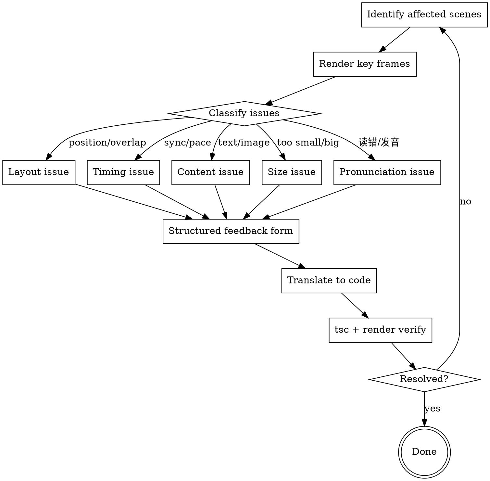

# Remotion Video Review

## Overview

After implementing Remotion scenes, users preview in Remotion Studio and see visual problems. This skill converts vague visual complaints ("move it a bit to the left") into structured layout descriptions that map directly to code changes.

**Core principle:** Visual feedback is inherently imprecise. Don't guess — ask structured questions that produce precise layout specifications.

## When to Use

- User says "the layout doesn't look right" after previewing
- User describes positional changes in natural language ("move up", "align this")
- User reports timing issues ("this element appears too late")
- After any `npx remotion studio` preview session with feedback

**Do NOT use for:**
- New scene creation (use remotion-video-design)
- Technical Remotion errors (use remotion-best-practices)
- Content/copy changes (just edit directly)

**Pipeline position:** Final step. Used after remotion-video-development implementation.

## Process Flow



## Step 1: Identify Affected Scenes

Ask user: "Which scenes have issues?" If they say "all of them", go scene by scene starting from Scene 1.

For each affected scene, render a key frame at the moment the issue occurs:
```bash
npx remotion still --frame=<FRAME_FROM_TIMELINE>
```

## Step 2: Classify the Issue

Listen to the user's feedback and classify:

| Type | Keywords | Root Cause |
|------|----------|------------|
| Layout | "overlap", "misaligned", "too far", "cropped", "not centered" | Absolute positioning / wrong flex properties |
| Timing | "too early", "too late", "appears before mention" | T constants don't match voiceover |
| Content | "wrong text", "wrong image", "should say" | Copy/image mismatch |
| Size | "too small", "too big", "can't see" | Fixed dimensions too large/small |
| Pronunciation | "读错了", "发音不对", "听起来怪", "读成了字母" | TTS mispronouncing a word |

## Step 3: Structured Feedback Form

Instead of accepting vague descriptions, guide the user through this form. **Ask one category at a time.**

### For Layout Issues

Present the current layout as structured YAML and ask user to edit it:

```yaml
# Current layout for Scene N:
scene:
  regions:
    - name: "upper"
      type: horizontal-split
      left: [4 cards, width: 900]
      right: [避雷 block, centered in remaining space]
    - name: "lower"
      type: vertical-stack
      items: [希望_text, 预告_card]

# What should change? (user fills in):
changes:
  - region: "upper"
    change: "right side should align top with card1, not center"
  - region: "lower"
    change: "add more top margin, not flush against upper"
```

**If user struggles with YAML:** Offer these structured options:

```
ALIGNMENT OPTIONS:
  a) top-aligned     → alignItems: "flex-start"
  b) center-aligned  → alignItems: "center"
  c) bottom-aligned  → alignItems: "flex-end"
  d) stretch-equal   → alignItems: "stretch"

POSITION OPTIONS (for overlay elements):
  a) relative to another element (which? top/bottom/left/right?)
  b) relative to viewport edge (which edge? distance?)
  c) centered in container

SIZE OPTIONS:
  a) fixed width ___px
  b) fill remaining space (flex: 1)
  c) match another element (which?)
```

### For Timing Issues

**First, check subtitle timestamps** (most precise source):
```bash
python ~/.claude/skills/remotion-tools/align-timeline.py  # regenerate from Minimax subtitle data
```

Then show the discrepancy:
```
Subtitle says "抵扣系数" starts at frame 412 (from Minimax)
Current code: Card3 appears at frame 385
Offset: -27 frames (0.9s early)

What should the frame be? Or should it be earlier/later by about ___ seconds?
```

**If no subtitle file** (edge-tts fallback):
```
Current: Card3 appears at frame 385 (12.8s)
Voiceover says "抵扣系数" at approximately frame ___
What should the frame be?
```

### For Content Issues

Direct edit — just confirm the change:
```
Current text: "自用 Coding Plan 体验优化工具"
Change to:    "Coding Plan 体验优化工具 llm-simple-router"
Confirm? (also need to update voiceover?)
```

### For Pronunciation Issues

**Not a code fix — update the pronunciation rules and regenerate audio.** (Full fix loop in remotion-video-development Pronunciation Fix Loop)

1. Identify the mispronounced word and which segment:
   ```
   Scene 3, seg1 (~8s): "KIMI K2.6" is read as "K-I-M-I K-two-point-six"
   Should sound like: "key mi K 二点六"
   ```

2. Check if rule exists in `~/.claude/voice-replace-text/minimax-tts.json`:
   - If missing → add new rule
   - If existing but wrong → update the replacement text

3. Regenerate only the affected segment:
   ```bash
   python ~/.claude/skills/remotion-tools/generate-voiceover.py --scene scene3 --segment 1 --force
   ```

4. Re-run timeline alignment (audio length may change):
   ```bash
   python ~/.claude/skills/remotion-tools/align-timeline.py
   ```

5. Update `theme.ts` duration for affected scene if length changed

### For Size Issues

**Most size issues stem from incorrect fixed dimensions or missing constraints.**

1. Present the current dimensions and the problem:
   ```
   Current: image container 400x300px
   Issue: "too small, can't see details"
   ```

2. Ask: "What should it match?" Options:
   - Match another element's width/height (which element?)
   - Fill available space (`flex: 1`)
   - Fixed size: ___px
   - Scale proportionally (current aspect ratio, target width or height)

3. Apply the size change to the corresponding constant (e.g., `IMG_W`, `IMG_H`, `CARD_WIDTH`) in the scene file.

## Step 4: Translate to Code

Map structured feedback to specific code changes:

| Feedback Pattern | Code Change |
|-----------------|-------------|
| "align tops" | `alignItems: "flex-start"` |
| "align bottoms" | `alignItems: "flex-end"` |
| "center horizontally" | `margin: "0 auto"` or `justifyContent: "center"` |
| "fill remaining width" | `flex: 1` |
| "move below element X" | Put in flex flow after X with `marginTop` |
| "don't overlap" | Remove absolute positioning, use flex flow |
| "not at very bottom" | Remove `flex: 1` on sibling, use natural flow |
| "reduce image" | Change IMG_W / IMG_H constants |
| "appear earlier" | Decrease T.constant value |
| "appear later" | Increase T.constant value |
| "timing off" | Regenerate `align-timeline.py`, use subtitle anchor frames |
| "读错了/发音不对" | Add rule to `minimax-tts.json`, regenerate with `--scene --segment --force`, re-align timeline |

## Step 5: Verify

After each change:
1. `npx tsc --noEmit` — no new errors
2. Render affected frame again — `npx remotion still --frame=N`
3. Ask user: "Does this look right now?"

## Anti-Patterns

| User Says | Don't Do This | Do This Instead |
|-----------|--------------|-----------------|
| "move it a bit to the left" | Guess 20px | Ask: "relative to what? fixed pixel or relative to element?" |
| "make it bigger" | Increase by 50px | Ask: "to match which element? or fill available space?" |
| "align with that thing" | Guess which element | Ask: "which element specifically? top/bottom/left/right edge?" |
| "it looks wrong" | Try random changes | Ask: "screenshot at what frame? what specifically looks wrong?" |
| "not centered" | Add `textAlign: center` | Distinguish: horizontal center in what container? vertical too? |

## Common Fix Templates

### Element overlapping with sibling
```
Problem: absolute positioning causes overlap
Fix: Remove position:absolute, put in flex flow with marginTop
```

### Element stuck at bottom of screen
```
Problem: sibling has flex:1, pushing element to bottom
Fix: Remove flex:1 from sibling, let both take natural height
```

### Image cropped/cut off
```
Problem: objectFit: cover
Fix: Change to objectFit: "contain"
```

### FadeIn breaking flex layout
```
Problem: FadeIn wraps the flex container itself
Fix: Move FadeIn inside the container, wrap only the content block
```

### Bottom-aligned pair misaligned
```
Problem: one has fixed height, other doesn't
Fix: Use alignItems: "flex-end" on parent, remove fixed heights
```
